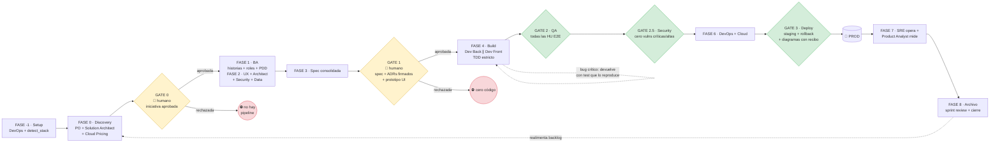
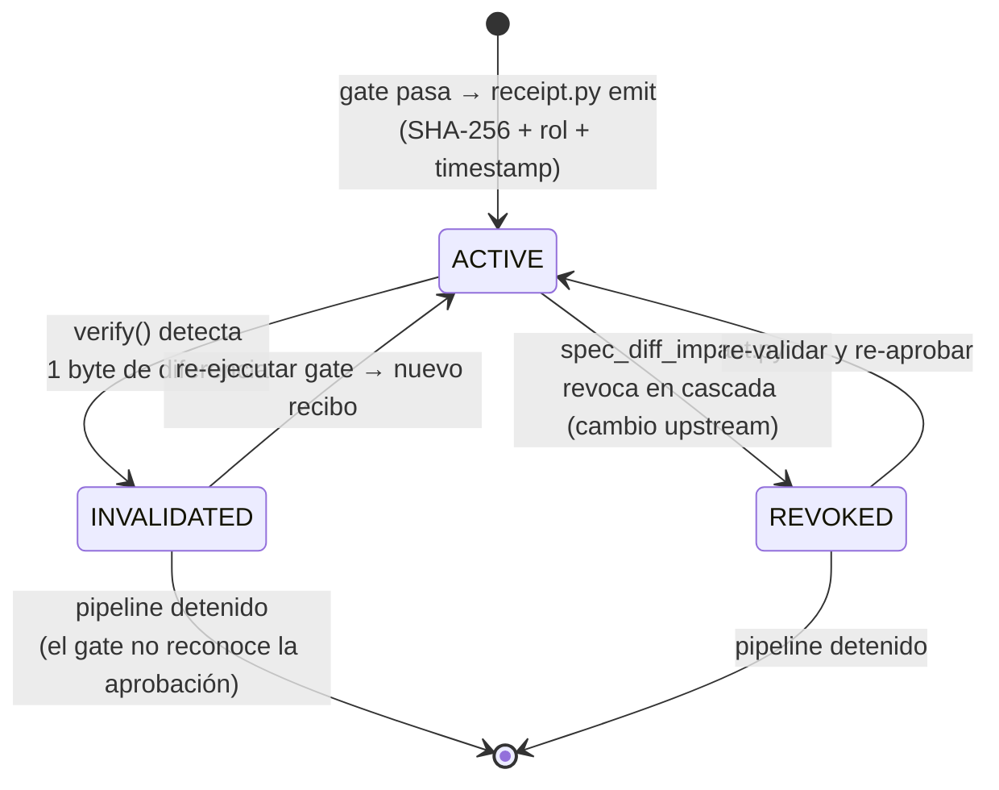
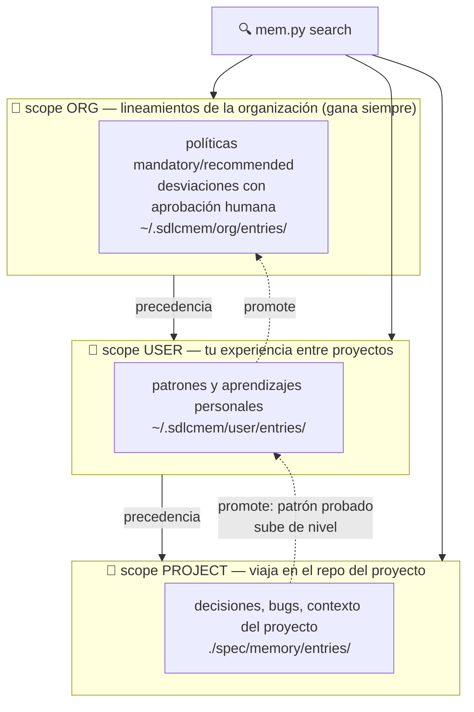

# Arnés SDLC — SDD + TDD + RDD con gobernanza de decisiones

[](https://github.com/csalamando/harness-sdlc/actions/workflows/self-test.yml)
[](https://github.com/csalamando/harness-sdlc/releases)
[](LICENSE)

**Un arnés para agentes de IA** que gobierna el ciclo de vida completo del software (**SDLC**) combinando **Spec-Driven Development (SDD)**, **Test-Driven Development (TDD)** y **Receipt-Driven Development (RDD)**: la spec versionada manda (SDD), los tests preceden al código (TDD) y toda aprobación es un recibo criptográfico verificable, no la narración del agente (RDD). Está implementado como un conjunto de **21 skills** que siguen el estándar abierto **Agent Skills** (SKILL.md + assets/references/scripts) — no es un framework de agentes propio, sino la capa de gobierno que convierte a cualquier agente compatible en un equipo de desarrollo con roles, gates y evidencia auditable. Ejecutable en Kimi, Claude Code, Antigravity, Codex, Cursor, Copilot, VS Code, Open WebUI y LiteLLM.

> **Principio rector:** la fuente de verdad es `spec/` versionada en Git. Si una decisión, aprobación o aprendizaje no está versionada, no existe.

---

## ⚡ Quick start (2 minutos)

```bash
# 1. Descarga el ZIP de la última release:
#    https://github.com/csalamando/harness-sdlc/releases/latest
# 2. Descomprime cada <nombre>.skill en el directorio de skills de tu agente:
#    Kimi → Skills · Claude Code → .claude/skills/ · Cursor → .cursor/skills/ · Codex → ~/.codex/skills/
```
3. En tu proyecto, dile al agente: **"usa el orquestador SDLC para <tu iniciativa>"**

Eso es todo — el orquestador elige la ruta mínima, activa los roles y exige los gates. Guía completa por agente/IDE en [docs/guia-de-uso-arnes-sdlc.md](docs/guia-de-uso-arnes-sdlc.md).

---

## Tabla de contenidos

1. [Visión general](#1-visión-general)
2. [Las 21 skills](#2-las-21-skills)
3. [El pipeline y los gates](#3-el-pipeline-y-los-gates)
4. [Capacidades de gobierno](#4-capacidades-de-gobierno)
   - [Routing orgánico](#4a-routing-orgánico)
   - [Autoridad por rol](#4b-autoridad-por-rol-quién-puede-emitir-qué)
   - [Contexto mínimo e inteligencia de código](#4c-contexto-mínimo-e-inteligencia-de-código-v23)
   - [Telemetría de skills y Sprint Review](#4d-telemetría-de-skills-y-sprint-review-v24--v25)
   - [Diagramas como mecanismo de aceptación](#4e-diagramas-como-mecanismo-de-aceptación-de-cambios-v26)
5. [Receipts (RDD): confiar en evidencia, no en narración](#5-receipts-rdd-confiar-en-evidencia-no-en-narración)
6. [El sistema de memoria](#6-el-sistema-de-memoria)
7. [Gobernanza de decisiones (v2.0)](#7-gobernanza-de-decisiones-v20)
8. [Gestión de cambios de spec](#8-gestión-de-cambios-de-spec)
9. [Herramientas compartidas y propias](#9-herramientas-compartidas-y-propias)
10. [Créditos y referencias](#10-créditos-y-referencias)

---

## 1. Visión general

El arnés convierte a un agente de propósito general en un **equipo de desarrollo completo con roles especializados**, donde cada rol:

- tiene **entradas y salidas declaradas** (artefactos en `spec/`),
- cumple un **checklist de salida (DoD)** verificable por script,
- produce **evidencia auditable** (recibos criptográficos, memorias, trazabilidad),
- y no puede avanzar sin que los **gates** estén en verde.

Las tres disciplinas que combina, y por qué ninguna alcanza sola:

| Disciplina | Qué garantiza | Qué NO garantiza sola |
|---|---|---|
| **SDD** (Spec-Driven) | Todo nace de una spec versionada; sin spec no hay código | Que la spec aprobada siga siendo la que se ejecuta |
| **TDD** (Test-Driven) | Los tests preceden al código; todo bug vuelve con su test | Que los tests que "pasaron" lo hayan hecho de verdad |
| **RDD** (Receipt-Driven) | Toda aprobación es un recibo SHA-256 vinculado al contenido exacto; si cambia un byte, se invalida solo | — es la capa que hace verificables a las otras dos |

Tres ideas lo diferencian de un pipeline de prompts:

1. **RDD (Receipt-Driven Development):** las aprobaciones no son narración del agente ("ya está revisado"), sino recibos SHA-256 vinculados al contenido exacto aprobado. Si el artefacto cambia un byte, el recibo se invalida solo.
2. **Memoria persistente con gobierno:** lo aprendido no muere al cerrar la sesión. Vive en Markdown versionado con tres scopes (proyecto, usuario, organización) y un flujo de políticas y desviaciones con aprobación humana.
3. **Gobernanza de decisiones:** las decisiones técnicas significativas siguen un proceso riguroso de 8 pasos con scorecard cuantitativa, advice process y firma del Arquitecto — proporcional al riesgo (Risk Tiers).

---

## 2. Las 21 skills

Ordenadas por fase del pipeline (las transversales al final):

<details>
<summary><b>Ver la tabla completa de las 21 skills</b> (clic para desplegar)</summary>

| Skill | Rol | Fase |
|---|---|---|
| `sdlc-devops-engineer` | Setup + CI/CD + IaC + rollback | -1, 6 |
| `sdlc-product-owner` | Visión, épicas, backlog priorizado (el QUÉ y el CUÁNDO) | 0 |
| `sdlc-solution-architect` | Arquitecto de la iniciativa: apoya a PO/BA con historias, escribe historias técnicas, propuesta de arquitectura con opciones (GATE 0) | 0-2 |
| `sdlc-cloud-pricing` | Estimación CAPEX/OPEX/TCO por escenario en AWS y Azure — caso de negocio (GATE 0) y estimación fina (Fase 6) | 0, 6 |
| `sdlc-business-analyst` | Historias de usuario + Gherkin + reglas de negocio + catálogo de roles gobernado + PDD (AS-IS, condicional a automatización de procesos) | 1 |
| `sdlc-ux-designer` | Flujos UX + design system + tokens + prototipo de pantallas gobernado (Penpot, condicional a UI) | 2 |
| `sdlc-software-architect` | Arquitectura + OpenAPI + ADRs + test-plan. **Decision Owner técnico (el CÓMO)** | 2-3 |
| `sdlc-decision-engine` | Motor de decisiones: 8 pasos, scorecard, Decision Packages | 2 |
| `sdlc-enterprise-architect` | Tech Radar, Principios, excepciones, Paved Roads | 2 (Tier 1) |
| `sdlc-security-engineer` | Threat modeling + SAST/DAST (GATE 2.5) | 2, 4, 5 |
| `sdlc-data-engineer` | Migraciones + gobierno de datos | 2 |
| `sdlc-backend-dev-tdd` | Backend con TDD estricto | 4 |
| `sdlc-frontend-dev-tdd` | Frontend con TDD + mocks desde OpenAPI | 4 |
| `sdlc-qa-automation` | E2E desde Gherkin + regresión + carga (GATE 2) | 5 |
| `sdlc-cloud-engineer` | Infraestructura cloud + observabilidad | 6 |
| `sdlc-sre` | SLOs + incidentes + postmortems | 7 |
| `sdlc-product-analyst` | Medición de impacto → realimenta backlog | 7 |
| `sdlc-technical-writer` | Documentación doc-as-code (Wiki / Pages / Confluence) | 4-6 |
| `sdlc-orchestrator` | Orquestador del pipeline + 16 herramientas CLI | Transversal |
| `sdlc-memory` | Memoria persistente con scopes y gobierno | Transversal |
| `sdlc-diagrams` | Diagramas C4, cloud (AWS/Azure/GCP), secuencia, BPMN, Gantt, GitFlow vía drawio MCP + derivación desde IaC/workflows con aprobación por recibo | Transversal |

</details>

Separación de autoridad: **el PO nunca aprueba decisiones técnicas; el Arquitecto de Software es el único rol que firma ADRs.**

---

## 3. El pipeline y los gates



Todo gate que pasa **emite recibo**; todo consumo downstream **verifica recibo**.

| Gate | Qué exige |
|---|---|
| **GATE 0** (humano) | Aprobación de la iniciativa: propuesta de arquitectura con ≥2 opciones + recomendación justificada (scorecard con costo como criterio), historias técnicas registradas y estimación **CAPEX/OPEX/TCO vigente** (AWS/Azure, 3 escenarios). Sin caso de negocio aprobado, no hay pipeline de construcción. |
| **GATE 1** (humano) | Spec consolidada aprobada + sin `conflicts_with` de memoria pendientes + `policy check` en verde (toda política org mandatory attestada o con desviación aprobada vigente) + **cada ADR Tier 1-2 con 8 pasos validados, Advice Log registrado, Tech Radar cruzado y firma vigente** + **si la iniciativa tiene UI: inventario de pantallas con recibo vigente (sin prototipo aprobado, el Dev Front no implementa)**. Sin esto, cero código. |
| **GATE 2** | Todas las historias verificadas E2E. Bug crítico → se devuelve al dev **con el test que lo reproduce** (una corrección acotada; si falla, escala a humano). |
| **GATE 2.5** | Ninguna vulnerabilidad crítica/alta abierta. |
| **GATE 3** | Staging validado + rollback probado + diagramas derivados regenerados desde su fuente (IaC/workflows) con recibo vigente. |

Todo gate que pasa **emite recibo**; todo consumo downstream **verifica recibo**.

---

## 4. Capacidades de gobierno

Cinco mecanismos transversales mantienen al agente dentro de los carriles, en cualquier ruta y fase.

### 4a. Routing orgánico

No todo trabajo merece el pipeline completo. El orquestador elige la **ruta mínima** antes de empezar:

| Situación | Ruta |
|---|---|
| Cambio mecánico ya entendido, 1-3 archivos, spec intacta | **Directo**: dev con TDD + gate 2 |
| Se necesita explorar 4+ archivos para entender | **Exploración delegada**: sub-tarea acotada de lectura, luego decidir con evidencia |
| Bug en producción | **Hotfix**: QA reproduce con test → dev corrige (TDD) → gates 2 y 3 |
| Iniciativa o evolución de producto nueva | **Discovery**: PO + BA + Solution Architect + Cloud Pricing → propuesta con opciones, historias técnicas y CAPEX/OPEX → GATE 0 |
| Ambigüedad sustancial | **Full-pipeline**: proponer al usuario; iniciar solo tras aprobación |
| Cambio de alcance aprobado | **Change-request**: ver §8 |

Los gates de entrega (2, 2.5, 3) aplican **siempre**, sin importar la ruta.

### 4b. Autoridad por rol: quién puede emitir qué

Un dev puede *opinar* sobre un ADR (de hecho debe: Paso 5 del Advice Process), pero no puede *emitirlo*. La **matriz de autoridad** (`spec/authority-matrix.yaml`) declara un único rol dueño por artefacto, y el arnés la hace cumplir en tres niveles:

1. **Recibos con rol:** `receipt.py emit --role <rol>` — si el artefacto tiene owner declarado y el rol no coincide, el recibo se rechaza y el gate no reconoce la aprobación. Un ADR "aprobado" por un dev simplemente no existe para GATE 1.
2. **CI:** `authority_check.py` valida en cada PR que quien toca `spec/` tiene el rol dueño (mapeo usuario→rol en `spec/team-roster.yaml`).
3. **Git (frontera dura):** plantilla `CODEOWNERS` + branch protection — un PR que toca `spec/adr/` no se mergea sin el Arquitecto.

Cambiar la matriz es un cambio de gobierno: requiere PR y queda auditado en el historial.

**Roles gobernados (v2.7):** el "Como <rol>" de las historias no es una palabra libre — referencia `spec/roles.md`, el catálogo del BA donde cada rol es nombre + acciones que habilita + contexto/condiciones + reglas que lo restringen. El gate valida que los ROL-xx citados existan. Para iniciativas que automatizan o rediseñan procesos, el PDD (`spec/process-definition.md`) captura el AS-IS con excepciones, volúmenes y SLA, y exige firma del Process Owner (recibo) antes del diseño TO-BE.

**Prototipos de pantalla gobernados (v2.8):** las pantallas con sus flujos de interacción son el contrato visual del sprint — negocio las ve y las navega *antes* de escribir código, sin sorpresas en la demo. Estándar del arnés: **Penpot** (open-source, formato web abierto, self-hostable, MCP oficial): el archivo de diseño se versiona en `spec/ux/` junto al inventario `PANT-xx` y los renders, con recibo del `ux-designer`. GATE 1 exige el inventario aprobado para las pantallas del sprint; sin prototipo aprobado, el Dev Front no implementa. Un cambio de HU/flujo/rol revoca el recibo y las pantallas se re-aprueban. Si la organización usa Figma, el artefacto gobernado sigue siendo el export versionado — nunca la nube.

### 4c. Contexto mínimo e inteligencia de código (v2.3)

El contexto del agente es un recurso gobernado. Tres mecanismos para que el agente **lea solo lo que necesita**:

1. **`spec_index.py` → `spec/INDEX.md`**: digest de una página con hash y resumen de cada artefacto; el agente se orienta con un archivo y abre solo el que necesita (verificando recibo).
2. **`code_intel.py`**: motor de inteligencia de código propio (inspirado en [Gortex](https://github.com/zzet/gortex), reimplementado a medida): grafo de símbolos en SQLite derivable, Python stdlib puro, **sin daemon**. `context` devuelve el cuerpo exacto de un símbolo o el esqueleto del archivo en vez de leerlo completo; `impact` calcula el blast radius antes de editar; `tests` lista los tests candidatos (evidencia para GATE 2); `search` busca en firmas y docstrings (FTS5). Extracción `ast` para Python y patrones para 15 lenguajes más; reindex incremental por SHA-256 (~ms sin cambios). Si el índice no existe, el arnés degrada a lectura normal — la capacidad es opcional, nunca bloquea.
3. **`mem.py search --brief`**: una línea por memoria; se abre con `get` solo la relevante.

En change-request, el impacto total = `spec_diff_impact.py` (spec) + `code_intel.py impact` (código).

### 4d. Telemetría de skills y Sprint Review (v2.4 · v2.5)

La disciplina no se narra, se mide — y **sin meter telemetría en el contexto del agente** (la escritura es un flag en comandos que ya existen; la lectura es bajo demanda):

1. **`skill_metrics.py use --skill <rol> --fase <N>`**: el orquestador registra cada activación (append-only en `spec/metrics/usage.jsonl`).
2. **`receipt.py emit --tokens-src reportado|estimado --attempts K`**: tokens por artefacto — exactos si la plataforma del agente los expone, estimados por chars/4 si no (nunca depende de que el agente "se acuerde").
3. **`skill_metrics.py report` → `spec/METRICS.md`**: tres vistas — **aporte** (artefactos, % de gates al primer intento, tokens por skill), **cobertura** (detector de *freestyle*: un rol con artefactos pero sin activación registrada está trabajando por fuera de la skill; una activación sin artefactos es skill de adorno) y **señales** accionables para mejorar skills.
4. **`sprint_review.py --sprint <N>` (v2.5) → `spec/reports/sprint-review-NN.md`**: al cerrar cada sprint, snapshot versionado con avance del proyecto, desempeño del arnés, lead times por gate, **tendencia vs el sprint anterior** y aprendizajes — la visibilidad de largo plazo para ajustar basándose en datos.

En Fase 8 el orquestador genera `METRICS.md` y guarda las señales como memoria `learning` — la mejora de las skills se retroalimenta sola. `METRICS.md` nunca se inyecta en paquetes de contexto.

### 4e. Diagramas como mecanismo de aceptación de cambios (v2.6)

Los diagramas no son solo documentación: son un **punto de control**. Ningún diagrama cuenta sin recibo de aprobación del rol dueño sobre su contenido:

1. **Derivados de fuente** (nunca se editan a mano): `iac_to_diagram.py` genera la topología de despliegue desde `terraform.tfstate`/ARM (lo *realmente* desplegado, con iconos oficiales y clusters); `pipeline_diagram.py` genera el diagrama del CI/CD desde `.github/workflows/` y valida `needs:` rotos y ciclos. La regeneración **propone** el cambio → el diff en Git se revisa → el rol dueño lo **acepta** con `receipt.py emit --role cloud-engineer|devops-engineer`. Modo `check` = drift detection en CI y Fase 8.
2. **De diseño** (C4, secuencia, BPMN, Gantt, GitFlow): edición manual vía drawio MCP, pero si la spec que representan cambia, `spec_diff_impact.py` revoca su recibo → se actualizan y re-aprueban.
3. **Render headless** (`diagram_render.py`): `.drawio`/Mermaid → SVG/PNG vía drawio-desktop CLI o mmdc (este último renderiza bloques Mermaid dentro de Markdown — doc-as-code). Motores opcionales: sin ellos, el fuente versionado sigue siendo el entregable.

### 4f. Manifiesto dinámico del arnés (v2.9)

El arnés deja de describirse a sí mismo con prosa y números quemados. La fuente de verdad de cada skill vive en **el frontmatter de su propio SKILL.md** (campos `harness-*`: rol, fases, artefactos que posee, gates, condicionalidad, dependencias opcionales), y el **manifiesto es un artefacto derivado**, nunca editado a mano:

```bash
python3 manifest_check.py --summary   # vista legible: 21 skills, roles, fases, gates, owns, scripts
python3 manifest_check.py --check     # exit 1 si hay drift o inconsistencias (corre en self-test y CI)
python3 manifest_check.py --routing --sin-ui --sin-datos   # routing por fases derivado (v2.10)
```

`manifest_check.py --check` cruza las tres fuentes y falla si divergen: gates declarados vs los que `gate_checker.py` soporta, artefactos `owns` vs la matriz de autoridad, scripts declarados vs disco. `harness_doctor.py` lee sus expectativas del manifiesto — **añadir una skill o un script ya no requiere actualizar listas quemadas en tres archivos** (la clase de bug que motivó v2.8.1 queda cerrada estructuralmente).

**Routing derivado (v2.10):** al iniciar una iniciativa, el orquestador ejecuta `--routing` con los flags de condición (`--sin-ui`, `--sin-datos`, `--sin-procesos`) y obtiene los roles por fase que aplican — las capacidades condicionales que no aplican quedan **auto-excluidas** (sin UI no hay prototipo `spec/ux/`; sin proceso que automatizar no hay PDD; sin datos significativos `sdlc-data-engineer` no participa). Añadir una skill al routing = su frontmatter, sin tocar al orquestador.

*Inspiración: "Everything is a plugin" / capability seams de DeepSeek Harness (§10) — traducida a nuestro estándar Markdown agnóstico de agente. Las capas con rank (proyecto > usuario > bundled) se evaluaron y **se difirieron** ([ADR-001](docs/decisions/ADR-001-skills-por-capas-rank.md)): requieren madurez alta en estas herramientas y preferimos centralizar esas decisiones para que los equipos maduren sin asumir riesgos.*

**Grafo interactivo del pipeline (v2.11):** el mismo manifiesto alimenta un mapa visual navegable del arnés — las 6 macro-fases como nodos, las 21 skills agrupadas por fase, y los loops de realimentación (sprints, TDD, hotfix, delta-spec, impact-report → backlog). También es **derivado, nunca editado a mano**:

```bash
python3 harness_graph.py --write   # regenera docs/graph.html (self-contained, sin dependencias)
python3 harness_graph.py --check   # exit 1 si el grafo quedó atrás del manifiesto (self-test y CI)
```

Si añades una skill o cambias sus fases en el frontmatter, el grafo se regenera solo — el `--check` falla en CI si alguien olvida regenerarlo. Abre [`docs/graph.html`](docs/graph.html) en el navegador para explorarlo.

**Dashboard vivo del proyecto (v2.12, [ADR-002](docs/decisions/ADR-002-dashboard-html-proyecto.md)):** el mismo motor, alimentado del estado real de tu proyecto — **un solo `spec/dashboard.html`, siempre "el ahora"** (nunca un HTML por sprint; la historia la siguen guardando los `sprint-review-NN.md`, que el dashboard lee para las tendencias):

```bash
python3 harness_graph.py --proyecto .          # genera/actualiza spec/dashboard.html
python3 harness_graph.py --proyecto . --check  # exit 1 si quedó atrás (CI)
```

Muestra el pipeline con los gates pintados según sus recibos (vigente / invalidado / pendiente), la fase actual, los loops de feedback activos (bug, hotfix), contadores acumulados (sprints, releases, HU cerradas, gates al primer intento), tendencias por sprint con **alertas automáticas** cuando un lead time empeora, y las últimas memorias `learning`. Cero narración manual: todo deriva de `receipts/` + `spec/` + `spec/reports/`. **El dashboard es visualización, no evidencia** — la evidencia siguen siendo los recibos; por eso un dashboard desactualizado alerta en CI pero no bloquea gates.

---

## 5. Receipts (RDD): confiar en evidencia, no en narración

### El problema

Un agente puede *decir* "la spec está aprobada" o "los tests pasan". Esa afirmación no es verificable y puede quedar desactualizada en el momento en que alguien edita el archivo.

### La solución: recibos criptográficos

Cuando un gate pasa, `receipt.py emit` guarda en `spec/receipts/` un JSON con el **SHA-256 exacto del artefacto aprobado**, el gate, el rol y el timestamp:

```json
{
  "receipt_id": "RCP-GATE1-architecture",
  "artifact": "spec/architecture.md",
  "sha256": "bb5c683b...",
  "gate": "GATE-1",
  "status": "ACTIVE",
  "timestamp": "2026-08-20T..."
}
```



**Reglas del sistema:**

1. **Verificación antes de consumir.** Antes de que cualquier fase downstream use un artefacto, `receipt.py verify` recalcula el hash del archivo actual y lo compara con el recibo. Un byte de diferencia → recibo **INVALIDATED** y el gate debe re-ejecutarse. Nadie aprueba dos veces sin nueva evidencia.
2. **Revocación en cascada.** Un cambio de spec (`spec_diff_impact.py`) revoca automáticamente los recibos de todos los artefactos impactados downstream.
3. **Firma arquitectónica.** Variante especializada: `arch_signoff.py` emite `ARCH-xxx.json` firmado por el Arquitecto, con hash compuesto del ADR **y** de los artefactos de diseño (architecture.md, OpenAPI, modelo de datos, diagramas). Si el diseño diverge de lo firmado en Fase 4, el pipeline se detiene.
4. **Estados auditables.** `receipt.py status` muestra todos los recibos (ACTIVE / INVALIDATED / REVOKED) — un log de gobierno derivado de criptografía, no de memoria del agente.

```bash
python3 receipt.py emit --artifact spec/architecture.md --gate GATE-1
python3 receipt.py verify --artifact spec/architecture.md
python3 receipt.py status
python3 receipt.py revoke --artifact spec/architecture.md
```

*Inspiración: patrón de "receipts" y "trust derivable evidence" observado en el ecosistema de Gentleman-Programming (ver §10), reimplementado a nuestra medida sobre SHA-256 + Git.*

---

## 6. El sistema de memoria

### El problema

Los agentes olvidan todo al cerrar la sesión: decisiones y sus razones, bugs ya resueltos, aprendizajes del proyecto. Y las organizaciones no tienen forma de hacer cumplir sus lineamientos en un flujo de agentes.

### Arquitectura: Markdown es la verdad, SQLite es solo un índice

**La fuente de verdad son archivos Markdown** con frontmatter YAML y estructura What / Why / Where / Key details / Learned:

```
./spec/memory/entries/     # scope project — viaja en el repo del proyecto
~/.sdlcmem/user/entries/   # scope user    — compartida entre tus proyectos
~/.sdlcmem/org/entries/    # scope org     — lineamientos de la organización
```

Al ser Git-nativa, la memoria tiene **historial, diff, code review y resolución de conflictos gratis**. Junto a cada raíz existe un `index.db` (**SQLite con FTS5**) que solo acelera la búsqueda con ranking. Es **100% derivable**: se borra y se reconstruye con `mem.py reindex`. Nunca pierdes nada por tocar la DB.



```bash
# Consultar la memoria
python3 mem.py search "autenticación oauth"   # búsqueda federada en los 3 scopes
python3 mem.py get MEM-2026-0001
python3 mem.py timeline
# O directo sobre el índice:
sqlite3 spec/memory/index.db "SELECT id, title FROM memories_fts WHERE memories_fts MATCH 'oauth'"
```

Para agentes, `mem_mcp.py` expone las mismas 16 operaciones como **servidor MCP stdio** (`mem_save`, `mem_search`, `mem_policy_check`, ...).

### Scopes y precedencia

`project` < `user` < `org`. Una búsqueda consulta los tres y ordena por precedencia: la organización gana. La promoción (`mem.py promote MEM-x --to org`) lleva un patrón probado en un proyecto al nivel superior, registrando `derived_from`.

### Relaciones entre memorias

- **`supersedes`**: una memoria reemplaza a otra (la anterior queda como histórico).
- **`conflicts_with`**: dos memorias se contradicen → **bloquea GATE 1** hasta resolución humana (`conflicts resolve`).

### Gobierno organizacional: políticas y desviaciones

El caso que motivó el diseño: *"si en la organización hay prácticas y lineamientos que se deben cumplir, y un proyecto necesita cambiarlos, debe existir revisión y aprobación"*.

1. **Políticas** (`--type policy --enforcement mandatory|recommended`) se guardan en scope org. Antes de GATE 1, cada proyecto ejecuta `policy check` y `policy attest`: toda política mandatory debe estar **compliant** o tener una **desviación aprobada vigente**.
2. **Desviaciones** (`deviation request → approve|reject`): el proyecto solicita excepción con justificación; un humano aprueba con **fecha de expiración**. Mientras está *pending*, NO exime. Al expirar, el gate vuelve a bloquear. Las aprobaciones son irreversibles (auditoría).
3. **Filtro de secretos**: el scope org rechaza memorias que contengan credenciales (patrones de API keys, tokens, contraseñas) — la capa compartida nunca debe filtrar secretos.

```bash
python3 mem.py save --scope org --type policy --enforcement mandatory \
  --title "TLS 1.3 en toda comunicación externa" --what "..." --why "..."
python3 mem.py policy check          # exit 1 si hay violación → bloquea GATE 1
python3 mem.py deviation request --policy POL-1 --reason "..."
python3 mem.py deviation approve DEV-1 --approver "CISO" --expires 2026-12-31
```

*Inspiración: la separación memoria/herramientas y la idea de memoria persistente entre agentes de **Engram** (Gentleman-Programming) — el usuario decidió conscientemente **no adoptarlo** y construir uno propio mejorado: Git-nativo, con scopes, gobierno de políticas y desviaciones, relaciones y MCP (ver §10).*

---

## 7. Gobernanza de decisiones (v2.0)

Basada en el **framework de 8 pasos de Sonya Natanzon**, el **Advice Process** y el **Tech Radar** (ver §10).

### Risk Tiering — gobernanza proporcional al riesgo

`decision_sizing.py` analiza la spec y clasifica:

| Tier | Ejemplos | Gobernanza |
|---|---|---|
| **1** (alto) | PII, pagos, autenticación, datos críticos | 8 pasos + Advice completo + revisión Enterprise Architect |
| **2** (medio) | Microservicios, APIs, integraciones | 8 pasos + Advice con peers |
| **3** (bajo) | Herramientas internas, UI, prototipos | ADR simplificado + registro en memoria |

### Los 8 pasos (skill `sdlc-decision-engine`)

1. **Problem Statement** sin soluciones prematuras — el gate rechaza *"Necesitamos usar Kafka"*; exige el problema real.
2. **Last Responsible Moment** — fecha límite real, restricciones, costo de reversa.
3. **Criterios ponderados** (mín. 3, pesos = 100%) definidos **antes** de ver opciones. Opcionalmente cargados de un **Decision Package** pre-aprobado.
4. **Opciones** (mín. 2, ideal 3, una radicalmente diferente); se marcan las **Paved Roads**.
5. **Advice Process** — `advisor.py` identifica stakeholders por impacto (datos → Data Engineer; seguridad → Security Engineer; Tier 1 → siempre Enterprise Architect). El consejo **no es vinculante**; omitir la consulta **sí bloquea** el gate. Todo consejo queda en el **Advice Log**: quién, cuándo, qué, si se aplicó y por qué.
6. **Scorecard cuantitativa** — `scorecard_calculator.py` pondera criterios × opciones; la opción elegida debe ser la ganadora o tener justificación explícita.
7. **Decisión** — con consecuencias positivas esperadas y **negativas aceptadas**, y qué NO se decidió.
8. **Re-evaluation triggers** — condiciones que obligan a revisar la decisión.

### Firma y Tech Radar

- **Firma:** `arch_signoff.py` emite el recibo `ARCH-xxx.json`. Un ADR firmado **no se modifica**: se supersedea con uno nuevo. Si cambia tras la firma, el gate detecta el recibo invalidado.
- **Tech Radar** (`sdlc-enterprise-architect`): **ADOPT** = Paved Road (pre-aprobado) · **TRIAL** = justificación · **ASSESS** = ADR de excepción · **HOLD** = bloquea el gate salvo excepción aprobada por el Architecture Board.
- El Enterprise Architect **gobierna por excepción**: asesora, no veta; solo interviene en Tier 1, principio mandatory violado o tecnología en HOLD.

---

## 8. Gestión de cambios de spec

1. Declarar la relación del cambio: **supersedes** (reemplaza — flujo normal) o **conflicts_with** (contradice — requiere resolución humana, bloquea GATE 1).
2. `spec_diff_impact.py --cambiado <artefacto> --relation <rel>` lista el downstream invalidado (grafo de dependencias de la spec).
3. `receipt.py revoke` sobre cada artefacto impactado; re-ejecutar **solo** las fases afectadas.
4. Nueva versión + entrada en CHANGELOG.

En **Fase 8 (Archivo)**: merge de delta-specs en la spec maestra, memorias superseded, trazabilidad y recibos en verde, sprint review generado, sesión cerrada. La próxima iteración arranca desde spec consolidada.

---

## 9. Herramientas compartidas y propias

- **Compartidas (plataforma):** GitHub (repo del código **y** de la spec, versionados juntos; aprobar spec = mergear PR), Jira/GitHub Projects (backlog enlazado a `spec/`), Confluence/Wiki/Pages (documentación viva vía `sdlc-technical-writer`), drawio MCP (`sdlc-diagrams`), Penpot MCP (`sdlc-ux-designer`, prototipos de pantalla gobernados).
- **Propias del arnés (CLI en `sdlc-orchestrator/scripts/`):** `gate_checker.py`, `receipt.py`, `context_packager.py` (contexto mínimo por rol), `spec_diff_impact.py`, `traceability_matrix.py` (HU → test → código), `detect_stack.py` (sin test runner, TDD queda en pausa), `harness_doctor.py` (health check), `decision_sizing.py`, `advisor.py`, `arch_signoff.py`, `authority_check.py` (autoridad por rol), `code_intel.py` (inteligencia de código), `spec_index.py` (digest de la spec), `skill_metrics.py` (telemetría de skills), `sprint_review.py` (sprint review versionado), `manifest_check.py` (manifiesto dinámico derivado + drift), `harness_graph.py` (grafo interactivo del pipeline derivado del manifiesto + drift). **`sdlc-diagrams/scripts/`:** `iac_to_diagram.py` (despliegue derivado del IaC + drift), `pipeline_diagram.py` (CI/CD derivado de workflows + validación), `diagram_render.py` (render headless SVG/PNG).
- **Regla de gobierno:** toda herramienta debe producir o consumir un artefacto versionado. Si una decisión solo existe en una llamada, no existe.

---

## 10. Créditos y referencias

Este arnés es diseño e implementación propios, pero se apoya explícitamente en ideas publicadas por otros, a quienes damos crédito:

| Idea | Autor / Proyecto | Cómo la usamos |
|---|---|---|
| **Framework de decisiones de 8 pasos** | [Sonya Natanzon — Architectural Decision Framework](https://github.com/snatanzon/architectural-decision-framework) | Núcleo de `sdlc-decision-engine`: problem statement sin soluciones, criterios ponderados, scorecard, re-evaluation triggers |
| **Advice Process, Tech Radar, Principios, arquitectura conversacional** | [Martin Fowler / Andrew Harmel-Law — *Scaling Architecture Conversationally*](https://martinfowler.com/articles/scaling-architecture-conversationally.html) | Paso 5 (advice no vinculante pero obligatorio de registrar), Tech Radar con cuadrantes, gobernanza por excepción del Enterprise Architect |
| **Tech Radar (formato ADOPT/TRIAL/ASSESS/HOLD)** | ThoughtWorks | Estructura de `spec/tech-radar.yaml` y reglas de gate |
| **Architecture Decision Records** | Michael Nygard | Plantillas de ADR y ciclo de vida (Proposed → Adopted → Superseded) |
| **"Everything is a plugin" / capability seams** | [DeepSeek Harness](https://github.com/deepseek-ai/deepseek-harness) | Implementado en v2.9/v2.10 como **manifiesto dinámico + routing derivado**: metadatos en el frontmatter de cada SKILL.md, manifiesto derivado con detección de drift y routing por fases con capacidades condicionales auto-excluidas (`manifest_check.py`). Diferido: skills por capas con rank — [ADR-001](docs/decisions/ADR-001-skills-por-capas-rank.md) |
| **Patrones de trabajo con agentes, memoria entre agentes, receipts** | [Gentleman-Programming — gentle-ai](https://github.com/Gentleman-Programming/gentle-ai) y [Engram](https://github.com/Gentleman-Programming/engram) | **Inspiración, no adopción**: estudiamos su forma de trabajar y reimplementamos a nuestra medida — memoria Git-nativa con scopes/gobierno (diferencial sobre Engram, por decisión explícita del usuario) y recibos SHA-256 |
| **Code intelligence para agentes (grafo de símbolos, blast radius, menos tokens)** | [Gortex — zzet/gortex](https://github.com/zzet/gortex) (Apache 2.0) | **Inspiración, no adopción**: reimplementado como `code_intel.py` en Python stdlib, sin daemon, con extracción por niveles (ast/patrones) e índice SQLite derivable |
| **Diseño UX open-source (prototipos, tokens, estándares web)** | [Penpot](https://penpot.app) (MPL-2.0) | Herramienta estándar de `sdlc-ux-designer` para prototipos gobernados en `spec/ux/` — archivo versionable en Git, sin lock-in propietario |
| **Estándar Agent Skills** | Formato abierto SKILL.md (Anthropic y ecosistema) | Packaging, progressive disclosure (SKILL.md → references → scripts) |
| **Doc-as-code (Wiki/Pages/Confluence)** | GitHub Wiki, MkDocs Material, markdown-confluence | Publicación de `sdlc-technical-writer` |

Agradecimiento especial a los autores de las fuentes anteriores: este arnés no copia su código; adopta sus **ideas metodológicas** y las integra en un sistema coherente con recibos, memoria gobernada y gates automatizados.

---

## Versionado

El arnés sigue [SemVer](https://semver.org/lang/es/): **MAJOR** = cambios incompatibles en gates/recibos/spec, **MINOR** = skills o gates nuevos retrocompatibles, **PATCH** = correcciones. Cada versión se publica como [GitHub Release](https://github.com/csalamando/harness-sdlc/releases) con los `.skill` instalables adjuntos. Historial completo en [CHANGELOG.md](CHANGELOG.md).

## Licencia

MIT
