# 🛡 Arnés SDLC — Tu agente de IA, convertido en un equipo de desarrollo gobernado

[](https://github.com/csalamando/harness-sdlc/actions/workflows/self-test.yml)[](https://github.com/csalamando/harness-sdlc/releases)[](LICENSE)

> **La spec manda. Los tests primero. Y cada aprobación es un recibo criptográfico, no una promesa.**

Los agentes de IA ya escriben código. El problema es otro: **¿cómo gobiernas lo que hacen?** Sin spec versionada, sin tests primero y sin evidencia de las aprobaciones, un agente es un junior brillante con amnesia: narra lo que hizo, olvida lo que aprendió y nadie puede auditar sus decisiones.

El **Arnés SDLC** resuelve exactamente eso. Es una capa de gobierno — **21 skills** en el estándar abierto **Agent Skills** — que convierte a cualquier agente compatible en un equipo de desarrollo completo: roles especializados, gates que bloquean, recibos SHA-256 que se invalidan solos, memoria persistente entre sesiones y un portal web del proyecto que se deriva solo de la evidencia.

**No es otro framework de agentes. Es la disciplina que le faltaba al tuyo.** Funciona en Kimi, Claude Code, Antigravity, Codex, Cursor, Copilot, VS Code, Open WebUI y LiteLLM.

---

## 👥 Qué le brinda a cada rol de tu equipo

El arnés no reemplaza a los roles del SDLC: **los pone a trabajar con evidencia**. Cada rol humano (o el agente que lo ejerce) tiene artefactos propios que firma, gates que lo protegen y visibilidad de su aporte:

| Tu rol | Qué te brinda el arnés |
|---|---|
| **Product Owner** | Visión, épicas y backlog priorizado (RICE/MoSCoW) con métricas de éxito medibles por épica. El impact-report de Fase 7 te dice si las métricas se cumplieron *de verdad* y realimenta tu backlog con datos, no con percepciones. |
| **Business Analyst** | Historias de usuario con Gherkin, reglas de negocio BR-xxx con dueño en el modelo de datos, catálogo de roles gobernado y PDD. Tu análisis es contrato ejecutable: QA deriva los E2E de tu Gherkin, sin reinterpretaciones. |
| **UX / Diseño** | Flujos, design tokens (`tokens.json`) y prototipo gobernado en Penpot versionado en Git. Los devs front consumen tus tokens — un color hardcodeado es un defecto detectable, no una discusión. |
| **Arquitecto de Solución** | Propuesta de arquitectura con ≥2 opciones, scorecard cuantitativo y estimación CAPEX/OPEX/TCO antes de que negocio apruebe la iniciativa (GATE 0). Nadie aprueba a ciegas. |
| **Arquitecto de Software** | Eres el **único que firma ADRs** (8 pasos + scorecard + Advice Log) y el dueño de las **historias técnicas de alto nivel** (`technical-design.md`): los devs no improvisan diseño — su detalle deriva de lo que tú aprobaste. `arch_lint.py` convierte tu arquitectura en política binaria sobre el código. |
| **Desarrolladores (back/front)** | TDD estricto con evidencia en `git log` (red→green), mocks MSW derivados del contrato OpenAPI para trabajar en paralelo, y **dev-logs gobernados** (`dev-log-backend/frontend.md`): tu trabajo queda medido por HU en el portal y en el sprint review. Tu aporte es visible, no narrado. |
| **QA** | Los criterios Gherkin del BA se convierten en E2E ejecutables; un bug crítico se devuelve al dev **con el test que lo reproduce**. GATE 2 bloquea hasta que todas las HU pasan. |
| **Security** | Threat model STRIDE en Fase 2, SAST/SCA/DAST en pipeline y GATE 2.5: cero vulnerabilidades críticas/altas o no hay deploy. |
| **DevOps / Cloud / SRE** | Pipelines CI/CD completos, IaC con Terraform, runbooks y checklists de despliegue **con dueño en la matriz de autoridad**, diagramas de despliegue derivados con recibo, SLOs y postmortems sin culpables que realimentan el backlog. |
| **Process Owner / Auditoría** | PDD AS-IS firmado, auditoría append-only con cadena de hash (tamper-evident), recibos SHA-256 por aprobación y un **portal web del proyecto clasificado por rol gobernante** — cada artefacto vive donde manda su gobernante. |

---

## 🎯 El valor, en una frase

| Sin arnés | Con arnés |
|---|---|
| El agente *dice* que la spec está aprobada | Un recibo SHA-256 vinculado al contenido exacto lo **prueba** — si cambia un byte, la aprobación se invalida sola |
| El código aparece y luego se piensa la spec | **Sin spec aprobada no hay código** (SDD) — GATE 1 bloquea, literalmente |
| "Los tests pasan" | Los tests **preceden** al código (TDD) y el orden red→green se verifica en `git log` |
| Cada sesión empieza de cero | Memoria Git-nativa en 3 scopes (proyecto / usuario / organización) con políticas obligatorias y desviaciones con aprobación humana |
| Decisiones técnicas por intuición | Proceso de **8 pasos con scorecard cuantitativa**, Advice Process y firma del Arquitecto — proporcional al riesgo |
| El estado del proyecto se pregunta en reuniones | Un **portal web vivo** lo muestra todo, derivado 100% de recibos + spec, regenerado por CI |

---

## ⚡ Quick start (2 minutos)

```bash
# 1. Descarga el ZIP de la última release:
#    https://github.com/csalamando/harness-sdlc/releases/latest
# 2. Descomprime cada <nombre>.skill en el directorio de skills de tu agente:
#    Kimi → Skills · Claude Code → .claude/skills/ · Cursor → .cursor/skills/ · Codex → ~/.codex/skills/
```
3. En tu proyecto, dile al agente: **"usa el orquestador SDLC para \<tu iniciativa>"**

Eso es todo — el orquestador elige la ruta mínima, activa los roles y exige los gates. Guía completa por agente/IDE en [docs/guia-de-uso-arnes-sdlc.md](docs/guia-de-uso-arnes-sdlc.md).

---

## 🖥 Demo: el portal del proyecto (sobre el proyecto real CATI)

Un comando — `harness_graph.py --proyecto .` — genera `spec/portal/`: un portal web navegable, buscable (Ctrl+K) y con tema claro/oscuro, derivado **100% de recibos + spec** (cero narración manual). El menú lateral clasifica cada artefacto **por el rol que lo gobierna** (11 categorías: Negocio, Arquitectura, Desarrollo, QA, Agilidad, Procesos, UI/UX, DevSecOps, Plataforma, Auditoría) — no por tipo de documento. Así se ve en un proyecto real (**CATI**: catálogo TI corporativo, 35 HU, 13 ADRs, 4 sprints ejecutados):

| Inicio — pipeline, gates y progreso por HU | Métricas — tendencias y tiempos por gate | Arquitectura — ADRs ↔ Tech Radar |
|---|---|---|
| 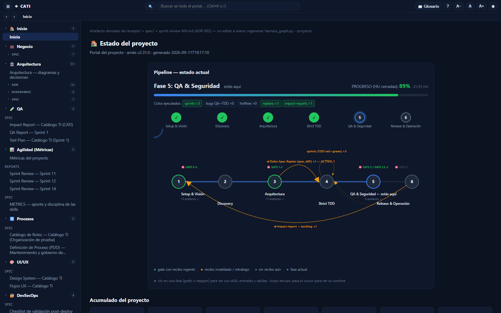 | 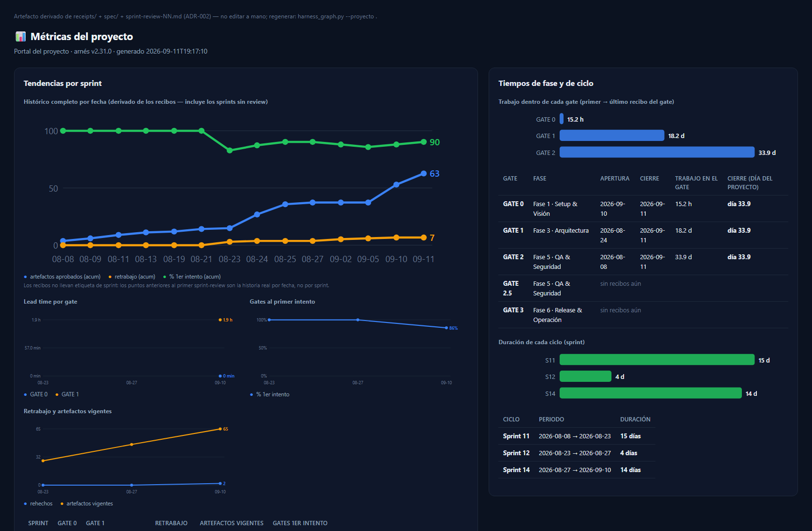 | 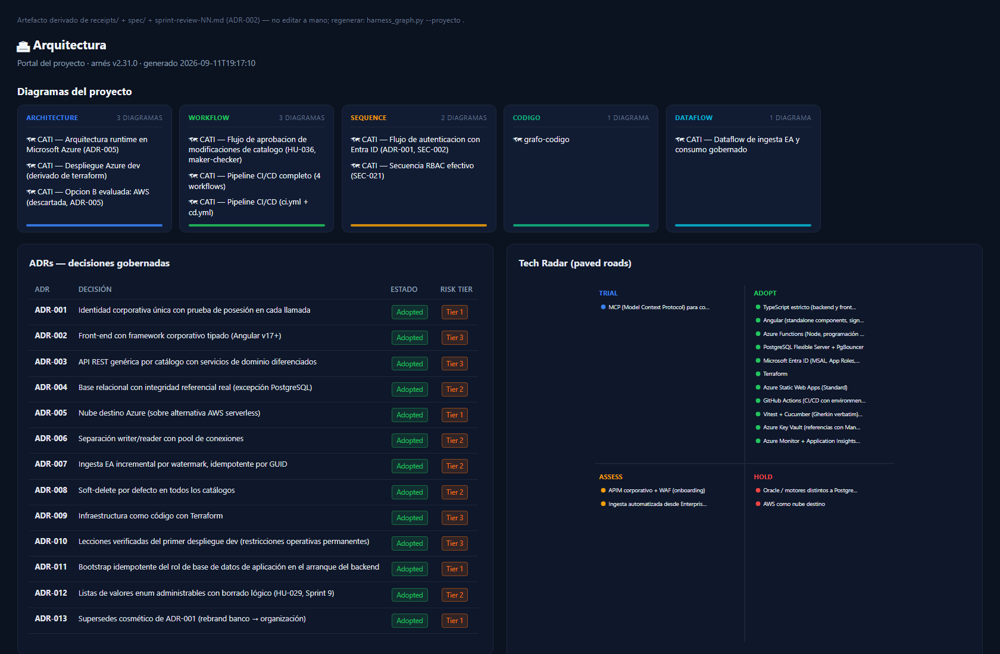 |

| Memoria — aprendizajes y handoffs | Auditoría — cadena de hash tamper-evident | Diagramas vivos — despliegue derivado de Terraform |
|---|---|---|
| 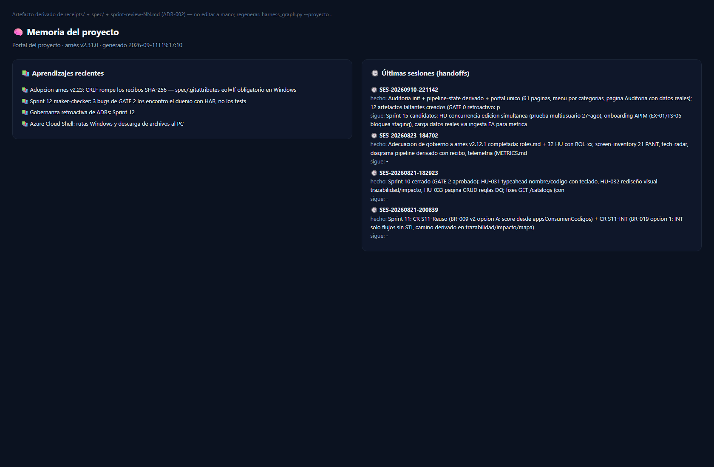 | 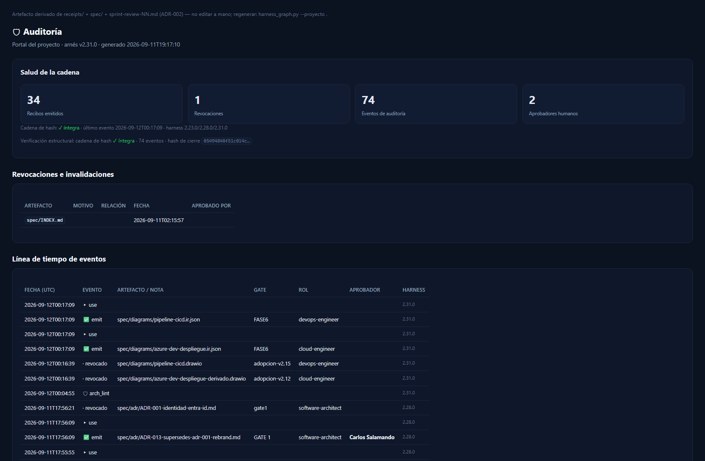 | 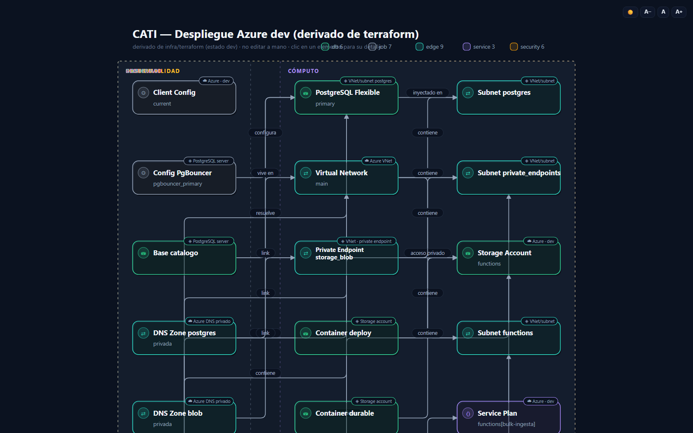 |

La página de Métricas incluye la gráfica **"Contribución por skill por sprint"** (barras apiladas derivadas de cada sprint review) con **alerta de skills silenciosas**: si un rol trabajó sin registrar su aporte, el portal lo evidencia — lo invisible no se puede medir.

Y el pipeline CI/CD no se dibuja a mano: `pipeline_diagram.py` lo **deriva de los workflows** de `.github/workflows/` y `check` detecta drift en CI — así se ven los 4 workflows de CATI (CI, CD, docs, gobernanza de spec):

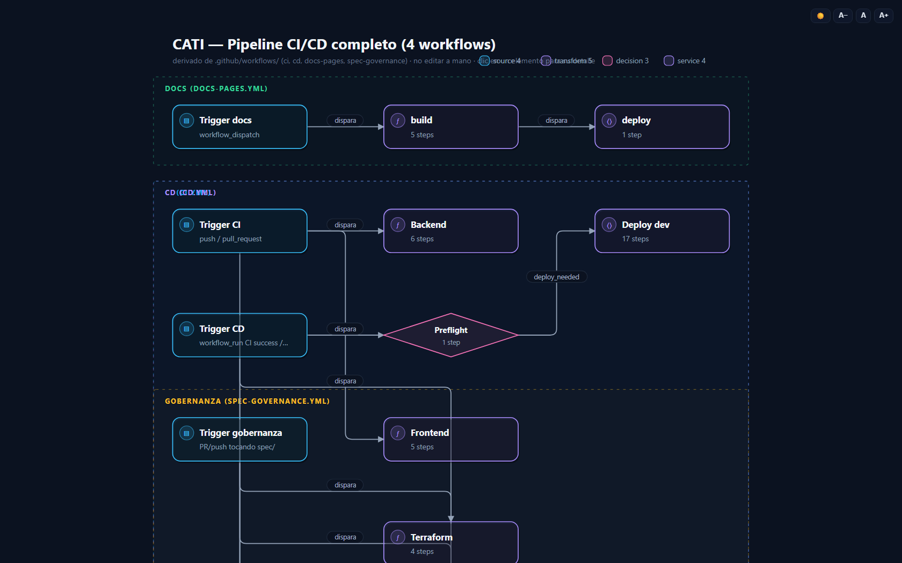

Diagramas vivos interactivos (IR): tema claro/oscuro, zoom, badges de ubicación de despliegue (☁ nube / ⌂ on-premise / ◈ otro), insights y foco compartible por URL:

<picture>
  <source media="(prefers-color-scheme: dark)" srcset="demos/arch-diagrams-oscuro.png">
  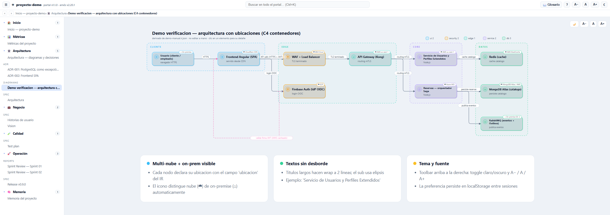
</picture>

Y cada sprint cierra con un **sprint review versionado** (gate bloqueante en CI — un sprint sin aprendizaje registrado no pasa, y **el review del sprint N exige que exista el del N-1**: la cadena de evidencia no admite huecos):

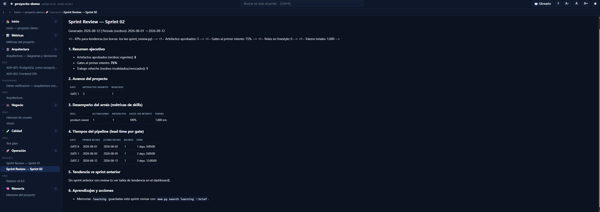

**Sistema de diseño (v2.32.0).** Todo el HTML que genera el arnés — portal, inicio/dashboard, diagramas IR, grafos de pipeline y de código — deriva de **tokens canónicos únicos** en `docs/design-system/tokens.json`: paleta dual-tema, tipografía system-ui, espaciado, motion y paletas dataviz gobernadas. Contraste WCAG AA verificado por script (19 pares auditados), anillo `:focus-visible`, `prefers-reduced-motion`, ARIA y los **cuatro estados** loading/empty/error/success como contrato. Cero colores hardcodeados: el self-test `[9i]` bloquea cualquier drift de estilo, y `?tema=claro|oscuro` fuerza el tema en cualquier URL.

---

## 🔄 El proceso: fases, gates y artefactos

[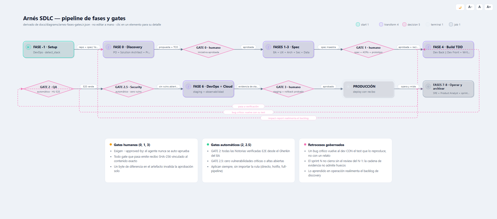](docs/diagrams/arnes-fases-gates.html)

_👆 Diagrama vivo generado con `diagram_ir.py` desde [su IR versionado](docs/diagrams/arnes-fases-gates.ir.json): abre la [versión interactiva](docs/diagrams/arnes-fases-gates.html) para hacer foco en cada fase, ver el detalle de cada gate y compartir estado por URL. Vista resumida en Mermaid:_

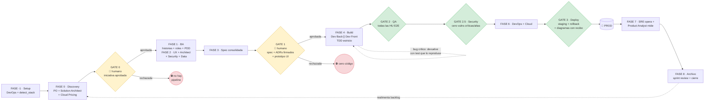

Todo gate que pasa **emite recibo**; todo consumo downstream **verifica recibo**. Sin excepciones.

### Qué exige cada gate

| Gate | Tipo | Qué exige |
|---|---|---|
| **GATE 0** | 🧑 humano | Iniciativa aprobada: propuesta de arquitectura con ≥2 opciones + recomendación justificada (scorecard con costo), historias técnicas y estimación **CAPEX/OPEX/TCO vigente** (AWS/Azure, 3 escenarios). Sin caso de negocio, no hay pipeline. |
| **GATE 1** | 🧑 humano | Spec consolidada + sin conflictos de memoria pendientes + políticas org attestadas + **cada ADR Tier 1-2 con 8 pasos validados, Advice Log, Tech Radar cruzado y firma vigente** + **prototipo de pantallas aprobado si hay UI**. Sin esto, cero código. |
| **GATE 2** | 🤖 automático | Todas las historias verificadas E2E. Bug crítico → se devuelve al dev **con el test que lo reproduce**. |
| **GATE 2.5** | 🤖 automático | Ninguna vulnerabilidad crítica/alta abierta. |
| **GATE 3** | 🧑 humano | Staging validado + rollback probado + diagramas derivados regenerados desde su fuente con recibo vigente. |

### Qué se genera en cada fase

Cada artefacto vive en `spec/` versionada en Git y tiene **un único rol dueño** (matriz de autoridad) y un **recibo** que lo certifica:

| Fase | Rol activo | Artefactos generados (salida gobernada) |
|---|---|---|
| **-1 · Setup** | `sdlc-devops-engineer` | CI/CD + IaC base, detección de stack (`detect_stack.py`) — sin test runner, TDD queda en pausa explícita |
| **0 · Discovery** | `sdlc-product-owner` · `sdlc-solution-architect` · `sdlc-cloud-pricing` | Visión y épicas · **propuesta de arquitectura con opciones** · historias técnicas (enablers, deuda, spikes, NFRs) · **estimación CAPEX/OPEX/TCO** por escenario → **GATE 0** |
| **1 · Análisis** | `sdlc-business-analyst` | Historias de usuario + Gherkin · reglas de negocio · **catálogo de roles gobernado** (`roles.md`) · PDD AS-IS firmado por el Process Owner (si automatiza procesos) |
| **2 · Diseño** | `sdlc-ux-designer` · `sdlc-software-architect` · `sdlc-security-engineer` · `sdlc-data-engineer` · `sdlc-decision-engine` · `sdlc-enterprise-architect` | Prototipo de pantallas gobernado (Penpot, `spec/ux/`) + design tokens · `architecture.md` + **diagramas IR** · contratos **OpenAPI** · modelo de datos · **ADRs firmados** (8 pasos + scorecard + Advice Log) · **historias técnicas de alto nivel** (`technical-design.md`, aprobadas por el Architect) · threat model · test-plan |
| **3 · Consolidación** | `sdlc-orchestrator` | Spec maestra consolidada + trazabilidad → **GATE 1** |
| **4 · Build** | `sdlc-backend-dev-tdd` · `sdlc-frontend-dev-tdd` · `sdlc-technical-writer` | **Diseño detallado por HU** (`technical-design-backend/frontend.md`, derivado del Nivel 1 del Architect — nadie improvisa diseño) · código backend y frontend con **TDD estricto** (commits `test(red)` antes de `feat(green)`, verificables en `git log`) · **dev-logs gobernados** que hacen medible cada HU entregada · documentación doc-as-code |
| **5 · QA** | `sdlc-qa-automation` · `sdlc-security-engineer` | E2E desde Gherkin · regresión · carga · reporte QA → **GATE 2 + GATE 2.5** |
| **6 · Infraestructura** | `sdlc-devops-engineer` · `sdlc-cloud-engineer` · `sdlc-cloud-pricing` | Staging y producción · observabilidad (logs, métricas, trazas, alertas) · estimación fina de costos · diagramas de despliegue derivados → **GATE 3** |
| **7 · Operación** | `sdlc-sre` · `sdlc-product-analyst` | SLOs · postmortems · **impact-report** de negocio que realimenta el backlog |
| **8 · Archivo** | `sdlc-orchestrator` · `sdlc-memory` | Merge de delta-specs · **sprint review versionado** (gate propio) · `METRICS.md` · memorias `learning` · portal regenerado · sesión cerrada con handoff |
| **Transversal** | `sdlc-orchestrator` · `sdlc-memory` · `sdlc-diagrams` | Recibos SHA-256 · auditoría append-only con cadena de hash · memoria en 3 scopes · portal del proyecto · trazabilidad HU→test→código |

> **Separación de autoridad:** el PO nunca aprueba decisiones técnicas; el Arquitecto de Software es **el único rol que firma ADRs**. Un recibo emitido por el rol equivocado simplemente no existe para el gate.

---

## 🧩 Las 21 skills

<details>
<summary><b>Ver la tabla completa de las 21 skills</b> (clic para desplegar)</summary>

| Skill | Rol | Fase |
|---|---|---|
| `sdlc-devops-engineer` | Setup + CI/CD + IaC + rollback | -1, 6 |
| `sdlc-product-owner` | Visión, épicas, backlog priorizado (el QUÉ y el CUÁNDO) | 0 |
| `sdlc-solution-architect` | Arquitecto de la iniciativa: historias técnicas Nivel 0 + propuesta con opciones (GATE 0) | 0-2 |
| `sdlc-cloud-pricing` | Estimación CAPEX/OPEX/TCO por escenario en AWS y Azure | 0, 6 |
| `sdlc-business-analyst` | Historias de usuario + Gherkin + roles gobernados + PDD | 1 |
| `sdlc-ux-designer` | Flujos UX + design system + prototipo gobernado (Penpot) | 2 |
| `sdlc-software-architect` | Arquitectura + OpenAPI + ADRs + historias técnicas de alto nivel + test-plan. **Decision Owner técnico (el CÓMO)** | 2-3 |
| `sdlc-decision-engine` | Motor de decisiones: 8 pasos, scorecard, Decision Packages | 2 |
| `sdlc-enterprise-architect` | Tech Radar, Principios, excepciones, Paved Roads | 2 (Tier 1) |
| `sdlc-security-engineer` | Threat modeling + SAST/DAST (GATE 2.5) | 2, 4, 5 |
| `sdlc-data-engineer` | Migraciones + gobierno de datos | 2 |
| `sdlc-backend-dev-tdd` | Backend con TDD estricto + diseño detallado y dev-log por HU (aporte medible) | 4 |
| `sdlc-frontend-dev-tdd` | Frontend con TDD + mocks desde OpenAPI + diseño detallado y dev-log por HU | 4 |
| `sdlc-qa-automation` | E2E desde Gherkin + regresión + carga (GATE 2) | 5 |
| `sdlc-cloud-engineer` | Infraestructura cloud + observabilidad | 6 |
| `sdlc-sre` | SLOs + incidentes + postmortems | 7 |
| `sdlc-product-analyst` | Medición de impacto → realimenta backlog | 7 |
| `sdlc-technical-writer` | Documentación doc-as-code (Wiki / Pages / Confluence) | 4-6 |
| `sdlc-orchestrator` | Orquestador del pipeline + 18 herramientas CLI | Transversal |
| `sdlc-memory` | Memoria persistente con scopes y gobierno | Transversal |
| `sdlc-diagrams` | Diagramas interactivos HTML (IR), Mermaid y pipeline CI/CD derivado | Transversal |

</details>

---

## 🏛 Los tres pilares (y por qué ninguno alcanza solo)

| Disciplina | Qué garantiza | Qué NO garantiza sola |
|---|---|---|
| **SDD** (Spec-Driven) | Todo nace de una spec versionada; sin spec no hay código | Que la spec aprobada siga siendo la que se ejecuta |
| **TDD** (Test-Driven) | Los tests preceden al código; todo bug vuelve con su test | Que los tests que "pasaron" lo hayan hecho de verdad |
| **RDD** (Receipt-Driven) | Toda aprobación es un recibo SHA-256 vinculado al contenido exacto; si cambia un byte, se invalida solo | — es la capa que hace verificables a las otras dos |

> **Principio rector:** la fuente de verdad es `spec/` versionada en Git. Si una decisión, aprobación o aprendizaje no está versionada, no existe.

---

## 🧾 RDD: recibos criptográficos, no narración

Un agente puede *decir* "la spec está aprobada". Esa afirmación no es verificable. En su lugar, cuando un gate pasa, `receipt.py emit` guarda un JSON con el **SHA-256 exacto del artefacto aprobado**, el gate, el rol y el timestamp:

```json
{
  "receipt_id": "RCP-GATE1-architecture",
  "artifact": "spec/architecture.md",
  "sha256": "bb5c683b...",
  "gate": "GATE-1",
  "status": "ACTIVE",
  "timestamp": "2026-08-20T..."
}
```

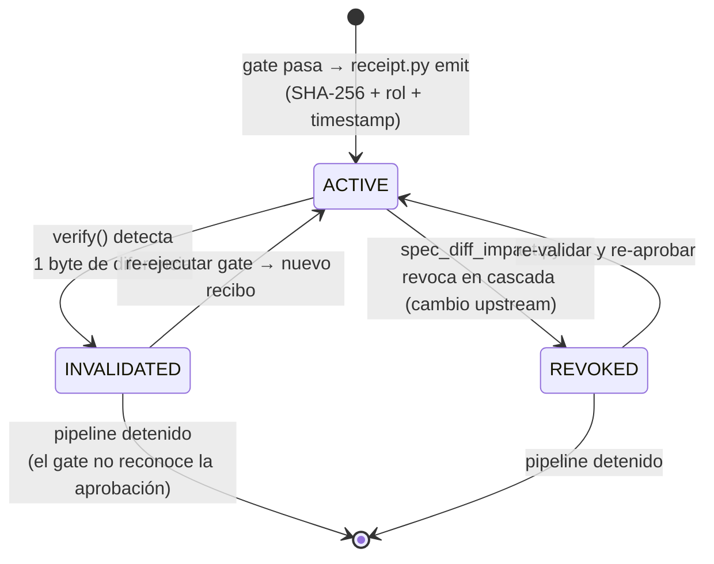

**Las reglas:**

1. **Verificación antes de consumir** — un byte de diferencia y el gate debe re-ejecutarse. Nadie aprueba dos veces sin nueva evidencia.
2. **Revocación en cascada** — un cambio de spec invalida automáticamente los recibos de todo el downstream impactado (con hash de dependencias en cada recibo, ni siquiera depende de que el agente lo recuerde).
3. **Firma arquitectónica** — `arch_signoff.py` firma ADR + diseño con hash compuesto; si el código diverge de lo firmado, el pipeline se detiene.
4. **Auditoría tamper-evident** — `spec/audit/events.jsonl` append-only con cadena de hash; el retrabajo y las revocaciones son hechos que nunca se sobrescriben. `audit_verify.py` detecta cualquier manipulación.
5. **El agente no se auto-aprueba** — los gates humanos (0/1/3, sprint review) exigen `--approved-by`.

```bash
python3 receipt.py emit --artifact spec/architecture.md --gate GATE-1 --role software-architect --approved-by "J. Pérez"
python3 receipt.py status --strict   # veredicto ejecutable para CI: exit 1 si algo no está vigente
```

---

## 🧠 Memoria que sobrevive a la sesión (y a la organización)

Los agentes olvidan todo al cerrar la sesión. Aquí, lo aprendido vive en **Markdown versionado** con tres scopes y precedencia — la organización siempre gana:

[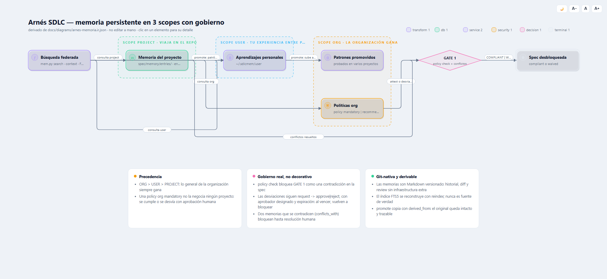](docs/diagrams/arnes-memoria.html)

_👆 [Versión interactiva](docs/diagrams/arnes-memoria.html) del flujo de memoria ([IR versionado](docs/diagrams/arnes-memoria.ir.json)). Vista resumida en Mermaid:_

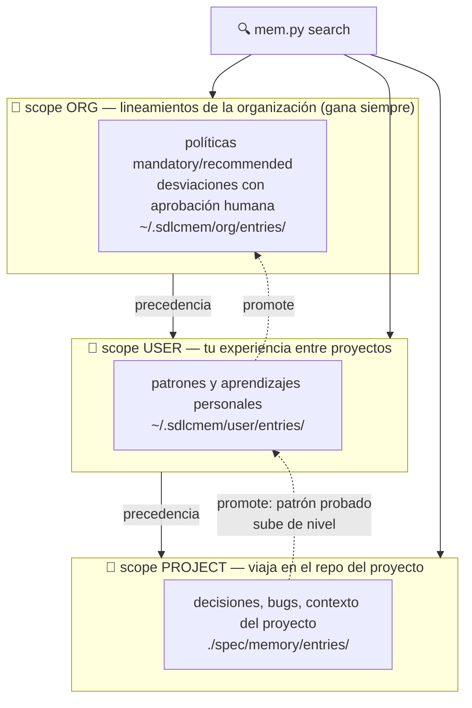

- **Git-nativa:** historial, diff y code review gratis. El índice SQLite/FTS5 es 100% derivable (`mem.py reindex`).
- **Gobierno real:** políticas org `mandatory` bloquean GATE 1 si no están attestadas o con **desviación aprobada con expiración** por un humano.
- **Conflictos detectados:** dos memorias que se contradicen bloquean GATE 1 hasta resolución humana.
- **MCP incluido:** las 16 operaciones expuestas como servidor MCP stdio para agentes.

---

## 🏢 Tu organización dentro del arnés: políticas, lineamientos y patrones

El arnés no arranca vacío: la organización inyecta **su** conocimiento una vez y cada proyecto lo hereda — y los gates lo hacen cumplir. Cuatro canales, cada uno con dueño y enforcement:

| Canal | Qué publica la organización | Dónde se hace cumplir |
|---|---|---|
| **Políticas org** (memoria scope `org`) | Lineamientos `mandatory` / `recommended` (seguridad, cumplimiento, estándares) | `policy check` **bloquea GATE 1**: attestation `compliant` o desviación aprobada por humano **con expiración** |
| **Tech Radar + Principios** | Tecnologías ADOPT/TRIAL/ASSESS/HOLD, principios arquitectónicos verificables, Decision Packages pre-aprobados (paved roads) | `gate_checker.py --check tech-radar` en GATE 1 — una tecnología en HOLD bloquea salvo ADR de excepción |
| **Matriz de autoridad + glosario** | Quién firma qué, quién ejerce cada rol, vocabulario canónico | `authority_check.py` en cada recibo: un recibo del rol equivocado no existe para el gate |
| **Reglas de arquitectura** | La arquitectura aprobada como política binaria sobre el código | `arch_lint.py` en CI: el código que diverge de lo firmado detiene el pipeline |

Y el conocimiento **fluye de vuelta**: los aprendizajes del proyecto se promueven (`mem.py promote`) de proyecto → usuario → organización, y los sprint reviews de Fase 8 cosechan aprendizajes como gate bloqueante. Guía completa de adopción: [docs/conocimiento-organizacional.md](docs/conocimiento-organizacional.md).

---

## ⚖️ Gobernanza de decisiones proporcional al riesgo

Las decisiones técnicas significativas siguen el **framework de 8 pasos** (problem statement sin soluciones prematuras → criterios ponderados → opciones → advice process → scorecard cuantitativa → decisión con consecuencias aceptadas → re-evaluation triggers), con **Risk Tiering**:

| Tier | Ejemplos | Gobernanza |
|---|---|---|
| **1** (alto) | PII, pagos, autenticación | 8 pasos + Advice completo + revisión Enterprise Architect |
| **2** (medio) | APIs, integraciones, microservicios | 8 pasos + Advice con peers |
| **3** (bajo) | Herramientas internas, UI | ADR simplificado + registro en memoria |

El **Tech Radar** (ADOPT / TRIAL / ASSESS / HOLD) convierte tecnologías en paved roads pre-aprobados o en gates bloqueantes. Y un ADR firmado **no se modifica**: se supersedea con uno nuevo.

---

## 🧭 Routing orgánico: no todo merece el pipeline completo

| Situación | Ruta |
|---|---|
| Cambio mecánico, 1-3 archivos, spec intacta | **Directo**: dev con TDD + gate 2 |
| Hay que explorar 4+ archivos para entender | **Exploración delegada** |
| Bug en producción | **Hotfix**: QA reproduce con test → dev corrige → gates 2 y 3 |
| Iniciativa nueva | **Discovery** → GATE 0 |
| Ambigüedad sustancial | **Full-pipeline**, solo tras aprobación del usuario |
| Cambio de alcance aprobado | **Change-request** con revocación en cascada |

Los gates de entrega (2, 2.5, 3) aplican **siempre**, sin importar la ruta.

---

## 🛠 Herramientas del arnés (stdlib + Git, sin dependencias)

`init_project.py` (scaffold determinista) · `gate_verify.py` · `gate_checker.py` · `receipt.py` · `audit_log.py` + `audit_verify.py` · `pipeline_state.py` · `spec_diff_impact.py --apply` (invalidación derivada) · `authority_check.py` · `arch_signoff.py` · `arch_lint.py` (la arquitectura como política binaria sobre el código) · `contract_diff.py` (bloquea breaking changes de API sin bump mayor) · `circuit_breaker.py` + `blast_radius_check.py` (HITL: el agente se congela y solo un humano lo descongela) · `code_intel.py` (grafo de símbolos, blast radius, menos tokens) · `context_packager.py` · `traceability_matrix.py` · `skill_metrics.py` · `sprint_review.py` · `tdd_order_check.py` · `manifest_check.py` · `harness_graph.py` (portal del proyecto) · `harness_doctor.py` · `diagram_ir.py` · `pipeline_diagram.py` · `diagram_render.py`

**Regla de gobierno:** toda herramienta produce o consume un artefacto versionado. Si una decisión solo existe en una llamada, no existe.

---

## 🙏 Créditos y referencias

Este arnés es diseño e implementación propios, pero se apoya explícitamente en ideas publicadas por otros, a quienes damos crédito:

| Idea | Autor / Proyecto | Cómo la usamos |
|---|---|---|
| **Framework de decisiones de 8 pasos** | [Sonya Natanzon — Architectural Decision Framework](https://github.com/snatanzon/architectural-decision-framework) | Núcleo de `sdlc-decision-engine`: problem statement sin soluciones, criterios ponderados, scorecard, re-evaluation triggers |
| **Advice Process, Tech Radar, Principios, arquitectura conversacional** | [Martin Fowler / Andrew Harmel-Law — *Scaling Architecture Conversationally*](https://martinfowler.com/articles/scaling-architecture-conversationally.html) | Paso 5 (advice no vinculante pero obligatorio de registrar), Tech Radar con cuadrantes, gobernanza por excepción del Enterprise Architect |
| **Tech Radar (formato ADOPT/TRIAL/ASSESS/HOLD)** | ThoughtWorks | Estructura de `spec/tech-radar.yaml` y reglas de gate |
| **Architecture Decision Records** | Michael Nygard | Plantillas de ADR y ciclo de vida (Proposed → Adopted → Superseded) |
| **"Everything is a plugin" / capability seams** | [DeepSeek Harness](https://github.com/deepseek-ai/deepseek-harness) | Implementado como **manifiesto dinámico + routing derivado**: metadatos en el frontmatter de cada SKILL.md, manifiesto derivado con detección de drift y routing por fases con capacidades condicionales auto-excluidas (`manifest_check.py`). Diferido: skills por capas con rank — [ADR-001](docs/decisions/ADR-001-skills-por-capas-rank.md) |
| **Patrones de trabajo con agentes, memoria entre agentes, receipts** | [Gentleman-Programming — gentle-ai](https://github.com/Gentleman-Programming/gentle-ai) y [Engram](https://github.com/Gentleman-Programming/engram) | **Inspiración, no adopción**: reimplementado a nuestra medida — memoria Git-nativa con scopes/gobierno y recibos SHA-256 |
| **Code intelligence para agentes (grafo de símbolos, blast radius, menos tokens)** | [Gortex — zzet/gortex](https://github.com/zzet/gortex) (Apache 2.0) | **Inspiración, no adopción**: reimplementado como `code_intel.py` en Python stdlib, sin daemon, con índice SQLite derivable |
| **Diagramas interactivos desde IR** | [archify — tt-a1i/archify](https://github.com/tt-a1i/archify) | **Inspiración, no dependencia**: patrón de diagramas vivos con foco, lens y estado por URL, reimplementado en `diagram_ir.py` (ADR-003) |
| **Visor Markdown estático** | [grip — joeyespo/grip](https://github.com/joeyespo/grip) | Inspiración del patrón de export; `mdview.py` es offline y sin dependencias |
| **Diseño UX open-source (prototipos, tokens, estándares web)** | [Penpot](https://penpot.app) (MPL-2.0) | Herramienta estándar de `sdlc-ux-designer` para prototipos gobernados en `spec/ux/` — versionable en Git, sin lock-in propietario |
| **Estándar Agent Skills** | Formato abierto SKILL.md (Anthropic y ecosistema) | Packaging, progressive disclosure (SKILL.md → references → scripts) |
| **Doc-as-code (Wiki/Pages/Confluence)** | GitHub Wiki, MkDocs Material, markdown-confluence | Publicación de `sdlc-technical-writer` |

Agradecimiento especial a los autores de las fuentes anteriores: este arnés no copia su código; adopta sus **ideas metodológicas** y las integra en un sistema coherente con recibos, memoria gobernada y gates automatizados.

---

## 📚 Documentación

[Guía de uso por agente/IDE](docs/guia-de-uso-arnes-sdlc.md) · [Conocimiento organizacional: políticas, lineamientos y patrones](docs/conocimiento-organizacional.md) · [Gobernanza a nivel GitHub](docs/gobernanza-github.md) · [Grafo interactivo del pipeline](docs/graph.html) · [Diagrama IR: fases y gates](docs/diagrams/arnes-fases-gates.html) · [Diagrama IR: memoria en 3 scopes](docs/diagrams/arnes-memoria.html) · [ADRs del arnés](docs/decisions/) · [CHANGELOG](CHANGELOG.md) · [CONTRIBUTING](CONTRIBUTING.md)

## Versionado

El arnés sigue [SemVer](https://semver.org/lang/es/): **MAJOR** = cambios incompatibles en gates/recibos/spec, **MINOR** = skills o gates nuevos retrocompatibles, **PATCH** = correcciones. Cada versión se publica como [GitHub Release](https://github.com/csalamando/harness-sdlc/releases) con los `.skill` instalables adjuntos. Historial completo en [CHANGELOG.md](CHANGELOG.md).

## Licencia

MIT
