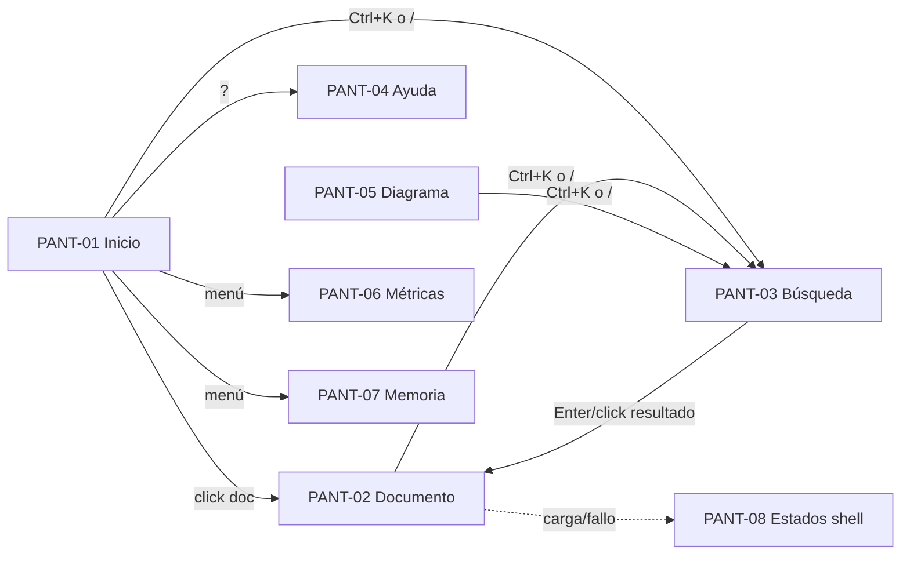

# Inventario de pantallas — Portal del arnés SDLC

> **Adaptación del estándar:** el portal del arnés no nace de `spec/user-stories.md` de un
> proyecto (es infraestructura del arnés, usada por todos los roles). En lugar de HU-xx,
> cada pantalla referencia la **capacidad del portal** que cubre (búsqueda, navegación,
> tema, zoom, diagramas). Todo lo demás sigue el estándar: estados loading/empty/error/
> success, interacciones con destino, y aceptación con recibo.
> Diseño visual: prototipo Penpot (se materializa cuando el MCP tenga proyecto conectado;
> hoy hay wireframes de referencia en `styleguide.html` + renders en `exports/`).
> Tokens: [`../tokens.json`](../tokens.json) · Contrato visual: [`../design-system.md`](../design-system.md).

## PANT-01 — Portal · Inicio (dashboard del pipeline)

- **Capacidad que cubre:** visión de avance del proyecto (fases, gates, estado)
- **Rol que la opera:** cualquier rol (PO, BA, arquitecto, dev, QA, DevOps…)
- **Estados diseñados:** loading (shimmer en nodos) / empty ("Sin fases registradas") / error (banner `--bad` + reintentar) / success (grafo + panel de detalle)
- **Componentes principales:** topbar (botones, búsqueda), sidebar de navegación, grafo de fases (nodos + aristas), panel de detalle de fase, tarjetas de gate, migas
- **Render:** `exports/PANT-01-inicio.png`

### Interacciones

| Disparador | Destino | Notas |
|---|---|---|
| Click en nodo de fase | panel de detalle de la fase (misma pantalla) | nodo activo: anillo `--accent` |
| Click en tarjeta de gate | documento del gate en PANT-02 | |
| Ctrl+K o / | PANT-03 | reenviado desde el iframe |
| ☰ | colapsa sidebar a riel de iconos | estado persistido en `dir-sidebar` |
| A− / A+ | zoom global rem (todo el chrome) | persistido en `dir-zoom` |

## PANT-02 — Portal · Página de documento

- **Capacidad que cubre:** lectura de spec renderizada (visión, ADR, user-stories, métricas…)
- **Rol que la opera:** cualquier rol
- **Estados diseñados:** loading (spinner del shell en el iframe) / empty ("Documento sin contenido") / error ("Error al cargar" + enlace a la fuente .md) / success (documento)
- **Componentes principales:** iframe de contenido (h1–h4, tabla, code/pre, blockquote), migas, botones ‹ ›
- **Render:** `exports/PANT-02-documento.png`

### Interacciones

| Disparador | Destino | Notas |
|---|---|---|
| ‹ › | historial del iframe dentro del portal | affordance agrupado con las migas |
| Enlace interno | otra página de documento en PANT-02 | |
| Click fuera del iframe con búsqueda abierta | cierra el dropdown | |

## PANT-03 — Portal · Búsqueda global (Ctrl+K / /)

- **Capacidad que cubre:** localización instantánea de documentos
- **Rol que la opera:** cualquier rol
- **Estados diseñados:** loading (debounce 120ms, sin flicker) / empty ("Sin resultados para '…'") / error (índice no disponible: mensaje + reconstruir) / success (lista con contador "N de M")
- **Componentes principales:** input `#q`, dropdown `#qres` (`.qr` filas, `.qc` categoría), botón 🔍
- **Render:** `exports/PANT-03-busqueda.png`

### Interacciones

| Disparador | Destino | Notas |
|---|---|---|
| Escribir ≥2 chars | filtra dropdown en vivo | resalta coincidencia |
| Enter / click en fila | abre el documento en PANT-02 | |
| Esc / click fuera | cierra dropdown | |
| Ctrl+K dentro del iframe | reenvío postMessage → focus en `#q` | |

## PANT-04 — Portal · Ayuda (atajos)

- **Capacidad que cubre:** descubribilidad de atajos de teclado
- **Rol que la opera:** cualquier rol
- **Estados diseñados:** success único (caja de atajos); no aplica loading/empty/error
- **Componentes principales:** `#helpbox` (panel flotante), lista de atajos con `<kbd>`
- **Render:** `exports/PANT-04-ayuda.png`

### Interacciones

| Disparador | Destino | Notas |
|---|---|---|
| Click en ? | abre/cierra `#helpbox` | |
| Click fuera | cierra | |

## PANT-05 — Portal · Diagrama IR vivo

- **Capacidad que cubre:** diagramas interactivos (arquitectura, C4, secuencia, despliegue…)
- **Rol que la opera:** arquitecto, equipo técnico
- **Estados diseñados:** loading (spinner) / empty ("Sin elementos que mostrar") / error (errores de validación IR listados, accionables) / success (diagrama + drill-down)
- **Componentes principales:** toolbar (tema, zoom, fullscreen, ⛶), lienzo SVG, panel de drill-down
- **Render:** `exports/PANT-05-diagrama.png`

### Interacciones

| Disparador | Destino | Notas |
|---|---|---|
| Click en nodo con drill-down | sub-diagrama (nivel C4 inferior) | migas del diagrama |
| Ctrl+K o / | PANT-03 | reenviado desde la página |
| A− / A+ | zoom del diagrama | |
| Toggle tema | claro/oscuro persistido | mismo `--bg`/`--fg` |

## PANT-06 — Portal · Métricas

- **Capacidad que cubre:** salud del pipeline (checks, cobertura, tech radar)
- **Rol que la opera:** QA, DevOps, EA
- **Estados diseñados:** loading / empty ("Sin métricas registradas") / error / success (barras, medidores, quadrantes ADOPT/TRIAL/ASSESS/HOLD)
- **Componentes principales:** barras horizontales SVG, badges de estado, tabla
- **Render:** `exports/PANT-06-metricas.png`

## PANT-07 — Portal · Memoria y auditoría

- **Capacidad que cubre:** decisiones, lecciones y trazabilidad (sdlc-memory)
- **Rol que la opera:** cualquier rol
- **Estados diseñados:** loading / empty ("Sin entradas de memoria") / error / success (línea temporal + filtros por rol/tema)
- **Componentes principales:** timeline, chips de rol, buscador
- **Render:** `exports/PANT-07-memoria.png`

## PANT-08 — Shell · Estados transversales del iframe

- **Capacidad que cubre:** feedback de carga y fallo en toda la navegación interna
- **Rol que la opera:** — (lo muestra el sistema)
- **Estados diseñados:** loading (spinner en el shell mientras el iframe carga) / error (página no encontrada o doc sin exportar: mensaje + enlace a la fuente) 
- **Componentes principales:** spinner, banner `--bad`, botón reintentar
- **Render:** `exports/PANT-08-estados.png`

---

## Mapa de navegación (resumen)



---

## Aceptación del prototipo

La aprobación sobre los renders / prototipo navegable se registra con recibo
(cuando el MCP de Penpot tenga proyecto conectado, el `.penpot` se versiona en
esta carpeta y los renders en `exports/`):

```bash
python3 skills/sdlc-orchestrator/scripts/receipt.py emit docs/design-system/ux/screen-inventory.md --role ux-designer
```

Cambio de tokens, de estas pantallas o de sus interacciones = recibo revocado y
re-aprobación. La implementación en generadores (Fase 3) no sustituye a esta
aceptación: el código implementa el diseño aprobado, no lo re-define.
