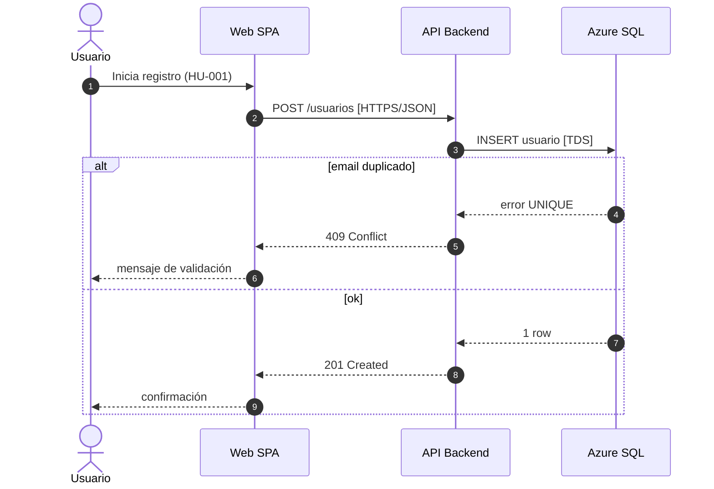
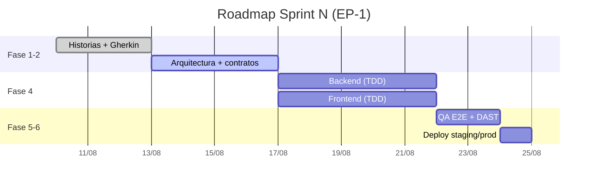
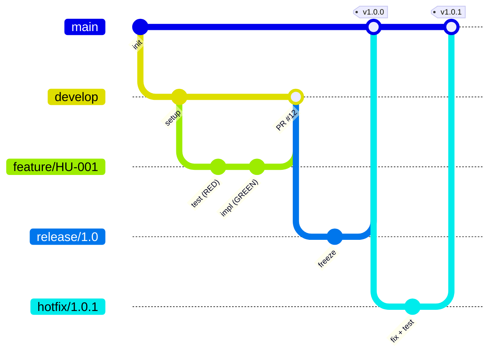

# Secuencia, Gantt y GitFlow vía Mermaid → drawio

Ruta de importación: generar el código Mermaid y abrirlo con `open_drawio_mermaid`. El servidor importa y convierte a shapes editables de draw.io.

## Diagrama de secuencia (UML)

Tips:
- `actor` para personas; `participant X as Nombre` para renombrar.
- `-->>` respuesta, `--)` asíncrono; `alt/else`, `loop`, `opt`, `par` para fragmentos.
- Activaciones: `activate API` / `deactivate API` si se quiere mostrar foco de control.
- Referenciar la HU en el primer mensaje o en una `Note over`.

## Gantt (roadmap / plan de sprint)

Tips: `done`/`active` para estado, `after <id>` para dependencias, `crit` para ruta crítica, `milestone` para hitos (gates: `GATE 1 :milestone, g1, after arch, 0d`).

## GitFlow / Git graph

Convención del arnés: ramas `feature/HU-xxx`, `hotfix/x.y.z`; merges a `develop`/`main` etiquetados con el PR; tags de versión en `main`. El diagrama documenta la estrategia de branching en `spec/` la primera vez (DevOps, Fase -1).

## Notas de importación

- Tras `open_drawio_mermaid`, el resultado es 100% editable: ajustar colores/layout en el editor o con `set_page`.
- El código Mermaid fuente se guarda también como comentario/página o en el `.md` de la spec para regeneración futura (Mermaid es más fácil de diff-ear que el XML resultante).
- Si la importación de una sintaxis falla, corregir el Mermaid antes de reintentar; no retocar el XML a mano para estas familias (regenerar es más barato).
