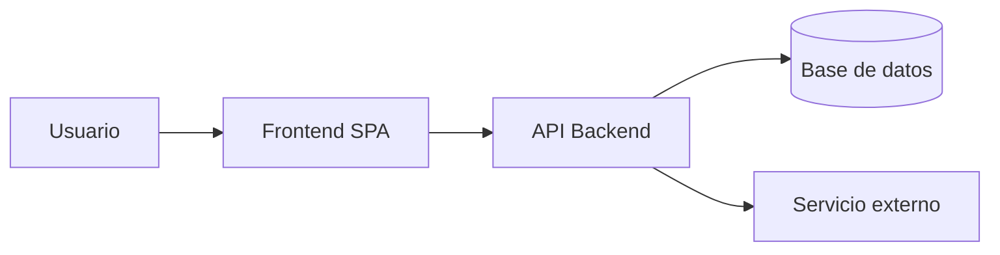

# Arquitectura

Versión: 0.1 | Fuente: user-stories.md, business-rules.md v<x>

## Estilo y decisiones macro
<monolito modular / microservicios / serverless + justificación breve>

## Diagrama de contenedores (C4)

## Componentes y responsabilidades
| Componente | Responsabilidad | Reglas de negocio dueñas |
|---|---|---|

## Requisitos no funcionales
| NFR | Meta cuantificada | Cómo se verifica |
|---|---|---|
| Latencia | p95 < 300ms | k6 en GATE 2 |
| Disponibilidad | 99.9% | SLO del SRE |

## Riesgos técnicos
| Riesgo | Mitigación |
|---|---|
