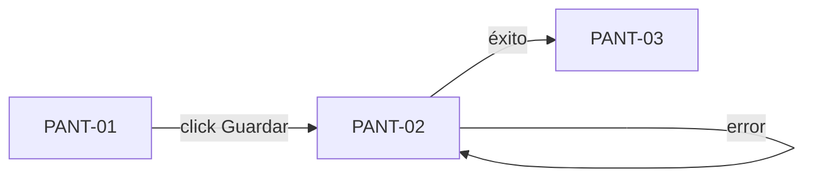

# Inventario de pantallas — <nombre del producto>

> Regla: una pantalla no es un dibujo suelto — es **nombre + HU que cubre + rol que la opera + estados + interacciones con destino**. Toda pantalla citada en las historias de usuario debe existir aquí, y toda pantalla de este inventario debe referenciar al menos una HU-xx existente en `spec/user-stories.md`.
> El diseño visual vive en `spec/ux/prototipo.penpot` (archivo versionado) y los renders para revisión en `spec/ux/exports/`. El prototipo es navegable: las interacciones de esta tabla son las conexiones del prototipo.

## PANT-01 — <nombre de la pantalla>

- **Historias que cubre:** HU-xxx, HU-xxx
- **Rol que la opera:** ROL-xx (ver `spec/roles.md`)
- **Estados diseñados:** loading / empty / error / success
- **Componentes principales:** <lista: tabla de resultados, formulario de filtros, modal de confirmación…>
- **Render:** `spec/ux/exports/PANT-01.png`

### Interacciones

| Disparador | Destino | Notas |
|---|---|---|
| Click en "<botón/elemento>" | PANT-02 | Valida campos obligatorios antes de navegar |
| Submit del formulario | PANT-03 (éxito) / se queda + error (fallo) | Error accionable: indica qué corregir |
| Timeout de carga | Estado error con reintento | SLA de percepción: skeleton < 1s |

## PANT-02 — <nombre de la pantalla>

- **Historias que cubre:** HU-xxx
- **Rol que la opera:** ROL-xx
- **Estados diseñados:** loading / empty / error / success
- **Componentes principales:** <…>
- **Render:** `spec/ux/exports/PANT-02.png`

### Interacciones

| Disparador | Destino | Notas |
|---|---|---|
| … | … | … |

---

## Mapa de navegación (resumen)



---

## Aceptación del prototipo

La aprobación de negocio sobre los renders / prototipo navegable se registra con recibo:

```bash
python3 scripts/receipt.py emit spec/ux/screen-inventory.md --role ux-designer
```

Sin recibo vigente, el Dev Front no implementa estas pantallas (GATE 1). Si cambian las HU, los flujos o los roles que tocan estas pantallas, el recibo se revoca y las pantallas impactadas se actualizan y re-aprueban.
