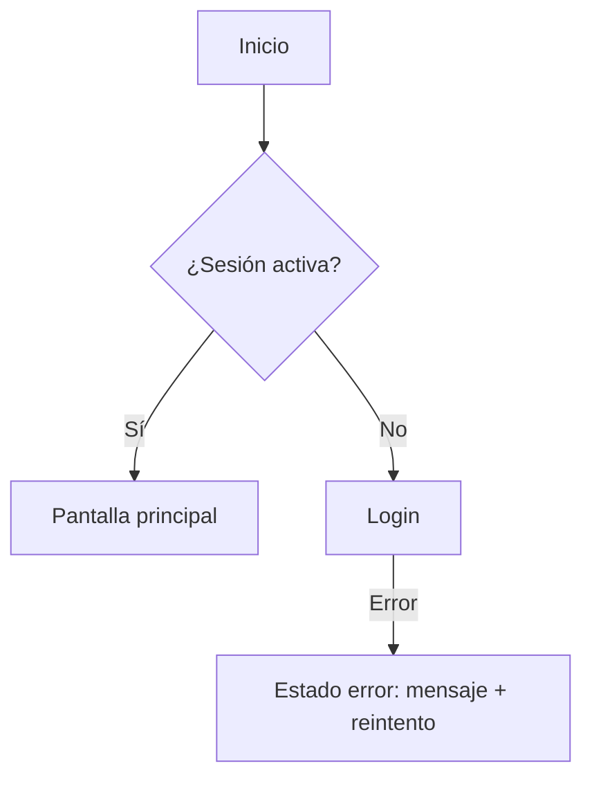

# Flujos de Usuario

Versión: 0.1 | Fuente: user-stories.md v<x>

## Flujo: <nombre> (HU-001)

### Estados por pantalla
| Pantalla | Loading | Empty | Error | Success |
|---|---|---|---|---|
| <nombre> | <qué se muestra> | <qué se muestra> | <mensaje + acción> | <contenido> |
